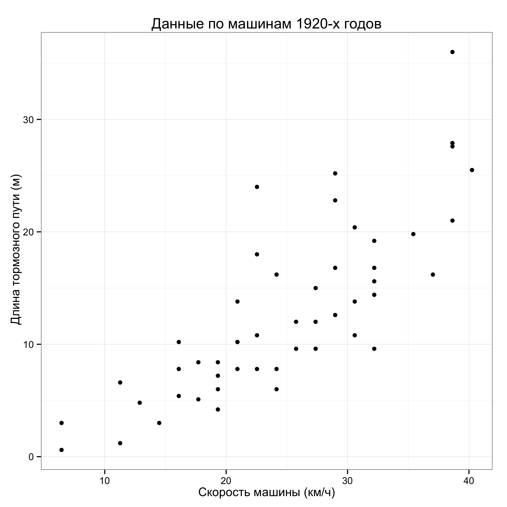

## Эконометрика на одном слайде :)

### Вопросы:

- Как устроен мир? Как переменная $x$ влияет на переменную $y$?
- Что будет завтра? Как спрогнозировать переменную $y$?

### Ответ: 

Модель --- формула для объясняемой переменной

### Например:

- $y_i=\beta_1+\beta_2 x_i + \varepsilon_i$
<!-- $y_{t}=y_{t-1}+\varepsilon_t$ -->


## Основные типы данных:

- Временные ряды
- Перекрёстные данные
- Панельные данные 

Есть много-много других!

## Временные ряды  

Данные по России:

Год   | Население   |  Безработица  
------|-------------|--------------
2010 | 142962       |  7.4  
2011 | 142914       |  6.5  
2012 | 143103       |  5.5  
2013 | 143395       |  5.5  

## Перекрёстная выборка  

Результаты зимних Олимпийских игр 2014:

Страна | Золото | Серебро | Бронза  
-------|--------|---------|--------
Россия | 13 | 11 |	9 	
Норвегия | 11 |	5 |	10 	
Канада |	10 |	10 	| 5 	
США |	9  |	7 |	12  

## Панельные данные 

Cочетание первых двух: данные по нескольким переменным для множества объектов в разные моменты времени


## Данные --- обозначения

- Одна зависимая, объясняемая, переменная: $y$
- Несколько регрессоров, объясняющих, переменных: $x$, $z$, $\ldots$
- По каждой переменной $n$ наблюдений: $y_1$, $y_2$, $\ldots$, $y_n$


## Данные --- пример 


Исторические данные 1920-х годов :)

| Длина тормозного пути (м), $y_i$ | Скорость машины (км/ч), $x_i$ |
|-----:|----:|
| 0.6 |  6.44|  
| 3.0 |  6.44|  
| 1.2 | 11.27|
| ...|  ...|


## Всегда изображайте данные!

 

## Модель:

Пример: $y_i=\beta_1 + \beta_2 x_i + \varepsilon_i$

- Наблюдаемые переменные: $y$, $x$
- Неизвестные параметры: $\beta_2$, $\beta_2$
- Случайная составляющая, ошибка: $\varepsilon$

### План действий
- придумать адекватную модель  
- получить оценки неизвестных параметров: $\hat{\beta}_1$, $\hat{\beta}_2$  
- прогнозировать, заменив неизвестные параметры на оценки:  
\[
\hat{y}_i=\hat{\beta}_1 + \hat{\beta}_2 x_i
\]


## Метод наименьших квадратов

- Способ получить оценки неизвестных параметров модели исходя из реальных данных.

Ошибка прогноза: $\hat{\varepsilon}_i=y_i-\hat{y}_i$.

Сумма квадратов ошибок прогноза:
\[
Q(\hat{\beta}_1,\hat{\beta}_2)=\sum_{i=1}^n \hat{\varepsilon}_i^2=\sum_{i=1}^n (y_i-\hat{y}_i)^2
\]

Суть МНК: В качестве оценок взять такие $\hat{\beta}_1$, $\hat{\beta}_2$, при которых сумма квадратов ошибок прогноза, $Q$, минимальна.

## Пример с машинами:

Фактические данные: 

$x_1=6.68$, $x_2=6.68$, ..., 

$y_1=0.6$, $y_2=3$, ...

Модель: $y_i=\beta_1+\beta_2 x_i+\varepsilon_i$. Формула для прогнозов:  $\hat{y}_i=\hat{\beta}_1 + \hat{\beta}_2 x_i$

Сумма квадратов ошибок прогнозов: $Q=\sum_{i=1}^n (y_i-\hat{y}_i)^2$

\[
Q=(0.6-\hat{\beta}_1-\hat{\beta}_2 6.68)^2+(3-\hat{\beta}_1-\hat{\beta}_2 6.68)^2+...
\]

Точка минимума, найдена в R: $\hat{\beta}_1=-5.3$, $\hat{\beta}_2=0.7$:

Формула для прогнозов:  $\hat{y}_i=-5.3 + 0.7 x_i$


## Простой пример [у доски]

Имя | Вес (кг), $y_i$ | Рост (см), $x_i$ |
|----:|-----:|----:|
| Вася|  60|  170|  
| Коля| 70|  170|  
| Петя| 80| 181|

Оцените модели:  
$y_i=\beta x_i +\varepsilon_i$,   
$y_i=\beta_1+\beta_2 x_i +\varepsilon_i$  

Маленькая подготовка: $n\bar{x}=\sum_i x_i=\sum_i \bar{x}$, $\sum_i (x_i - \bar{x})=0$.

<!--
Модель: $y_i=\beta x_i +\varepsilon_i$, Прогнозы: $\hat{y}_i=\hat{\beta}x_i$.

Сумма квадратов ошибок:
\[
Q(\hat{\beta})=(60-\hat{\beta}170)^2+(70-\hat{\beta}170)^2+(80-\hat{\beta}180)^2
\]

## Решение задачи минимизации

Сумма квадратов ошибок:
\[
Q(\hat{\beta})=(60-\hat{\beta}170)^2+(70-\hat{\beta}170)^2+(80-\hat{\beta}180)^2
\]

Производная:
\begin{multline}
Q'(\hat{\beta})=-2\cdot 170\cdot (60-\hat{\beta}170)-2\cdot 170\cdot(70-\hat{\beta}170)\\
-2\cdot 180\cdot(80-\hat{\beta}180)
\end{multline}

Приравняв производную к нулю получаем:
\[
\hat{\beta}=0.4047
\]
-->

## Готовые формулы МНК

В модели $y_i=\beta +\varepsilon_i$ 

\[
\hat{\beta}=\bar{y}
\]

В модели $y_i=\beta_1+\beta_2 x_i +\varepsilon_i$  

\[
\hat{\beta}_2=\frac{\sum (x_i-\bar{x})(y_i-\bar{y})}{\sum (x_i-\bar{x})^2}
\]
\[
\hat{\beta}_1=\bar{y}-\hat{\beta}_2\bar{x}
\]

точка $(\bar{x},\bar{y})$ лежит на прямой $\hat{y}=\hat{\beta}_1+\hat{\beta}_2 x$

## Терминология и обозначения:

$y_i$ --- зависимая, объясняемая, переменная

$x_i$ --- регрессор, объясняющая переменная

$\varepsilon_i$ --- ошибка, ошибка модели, случайная составляющая

$\hat{y}_i$ --- прогноз, прогнозное значение

$\hat{\varepsilon}_i=y_i-\hat{y}_i$ --- остаток, ошибка прогноза

$RSS=\sum_{i=1}^n \hat{\varepsilon}_i^2$ --- сумма квадратов остатков


## Графическая иллюстрация (чудо-доска)

!показать, что регрессия проходит через среднюю точку

<!--
## Три простых случая в явном виде

### $y_i=\beta+\varepsilon_i$
### $y_i=\beta x_i+\varepsilon_i$
### $y_i=\beta_1+\beta_2 x_i+\varepsilon_i$

## Случай $y_i=\beta+\varepsilon_i$. Нет объясняющей переменной. 

- Сколько лет Васе?

Анна: 35. Белла: 27. Вика: 34.

Спрогнозируем Васин возраст с помощью МНК!

Наблюдения: $y_1$, $y_2$, ..., $y_n$

Модель: $y_i=\beta+\varepsilon_i$. Прогнозы: $\hat{y}_i=\hat{\beta}$

Сумма квадратов остатков: $Q=\sum_{i=1}^n (y_i-\hat{y}_i)^2= \sum_{i=1}^n(y_i-\hat{\beta})^2$

Находим производную: $Q'(\hat{\beta})=\sum_{i=1}^n -2(y_i-\hat{\beta})$

## Случай $y_i=\beta+\varepsilon_i$. Решение.

Упрощаем производную:

\begin{multline}
Q'(\hat{\beta})=\sum_{i=1}^n -2(y_i-\hat{\beta})=-2 \sum_{i=1}^n (y_i-\hat{\beta})=\\
-2 (\sum_{i=1}^n y_i-\sum_{i=1}^n \hat{\beta})=-2(\sum_{i=1}^n y_i-n\hat{\beta})
\end{multline}

Приравняв к нулю получаем: $\sum_{i=1}^n y_i=n\hat{\beta}$ или

$\hat{\beta}=\sum_{i=1}^n y_i /n=(y_1+y_2+...+y_n)/n=\bar{y}$

МНК-прогноз возраста Васи: $\hat{\beta}=(35+27+34)/3=32$


## Случай $y_i=\beta x_i+\varepsilon_i$. Пропорциональность. 


## Случай $y_i=\beta_1 + \beta_2 x_i+\varepsilon_i$. Парная регрессия.


Предварительные замечания:

$\bar{x}=\sum_{i=1}^n x_i$, поэтому:

$n\bar{x}=\sum_{i=1}^n x_i$ или $\sum_{i=1}^n \bar{x}=\sum_{i=1}^n x_i$.
-->

## Много объясняющих переменных

$y_i=\beta_1+\beta_2 x_i +\beta_3 z_i+\varepsilon_i$

Выпишем систему уравнений для оценок $\hat{\beta}_1$, $\hat{\beta}_2$, $\hat{\beta}_3$

## Чудо доска

## Вывод 

Оценки находятся из системы


\[
\begin{cases}
\sum \hat{\varepsilon}_i \cdot 1 =0 \\
\sum \hat{\varepsilon}_i \cdot x_i =0 \\
\sum \hat{\varepsilon}_i \cdot z_i =0
\end{cases}
\]

## Суммы квадратов

сумма квадратов остатков, $RSS=\sum \hat{\varepsilon}_i^2$

общая сумма квадратов, $TSS=\sum (y_i-\bar{y})^2$

объясненная сумма квадратов, $ESS=\sum (\hat{y}_i-\bar{y})^2$


## Абсолютный ликбез по линейной алгебре 

Обозначения:

\[
y=\begin{pmatrix}
y_1 \\
y_2 \\
\vdots \\
y_n
\end{pmatrix}\;
x=\begin{pmatrix}
x_1 \\
x_2 \\
\vdots \\
x_n
\end{pmatrix}\;
\hat{\varepsilon}=\begin{pmatrix}
\hat{\varepsilon}_1 \\
\hat{\varepsilon}_2 \\
\vdots \\
\hat{\varepsilon}_n
\end{pmatrix}\;
\vec{1}=\begin{pmatrix}
1 \\
1 \\
\vdots \\
1
\end{pmatrix}
\] 

В нашей модели:
$\hat{y}=\hat{\beta}_1 \cdot \vec{1}+\hat{\beta}_2 \cdot x +\hat{\beta}_3 \cdot z$

\[
X=\begin{pmatrix}
1 & x_1 & z_1 \\
1 & x_2 & z_2 \\
\vdots \\
1 & x_n & z_n 
\end{pmatrix}
\]

## Длина вектора

Длина вектора, $|y|=\sqrt{y_1^2+y_2^2+\ldots+ y_n^2}$

Квадрат длины вектора, $|y|^2=y_1^2+y_2^2+\ldots + y_n^2=\sum_i y_i^2$

Примеры:  
$RSS=\sum \hat{\varepsilon}_i^2$ --- квадрат длины вектора $\hat{\varepsilon}$  
$TSS=\sum (y_i-\bar{y})^2$ --- квадрат длины вектора $(y-\bar{y}\cdot \vec{1})$

$\begin{pmatrix}
y_1-\bar{y} \\
y_2-\bar{y} \\
\vdots \\
y_n-\bar{y} 
\end{pmatrix} =
\begin{pmatrix}
y_1 \\
y_2 \\
\vdots \\
y_n 
\end{pmatrix} -
\bar{y}\begin{pmatrix}
1 \\
1 \\
\vdots \\
1 
\end{pmatrix}=y-\bar{y}\cdot \vec{1}$

## Скалярное произведение двух векторов:

\[
(x,y)=|x|\cdot |y|\cdot cos(x,y)
\]

\[
(x,y)=x_1 y_1 +x_2 y_2 +\ldots+ x_n y_n=\sum_i x_i y_i
\]

Условие перпендикулярности: $x \perp y$, $\sum_i x_i y_i=0$, т.к. $cos(90^\circ)=0$.

## Чудо-доска. 

Картинка для модели $y_i=\beta + \varepsilon_i$

Теорема Пифагора

## Геометрическая интерпретация условий первого порядка

\[
\begin{cases}
\sum \hat{\varepsilon}_i \cdot 1 =0 \\
\sum \hat{\varepsilon}_i \cdot x_i =0 \\
\sum \hat{\varepsilon}_i \cdot z_i =0
\end{cases}\; \Leftrightarrow \;
\begin{cases}
\hat{\varepsilon}\perp \vec{1} \\
\hat{\varepsilon}\perp x \\
\hat{\varepsilon}\perp z \\
\end{cases}
\]

## Чудо-доска. Картинка для множественной регрессии (с TSS и RSS)


## Если в регрессию включён свободный член $\beta_1$


Если в регрессию включён свободный член, $y_i=\beta_1 + \ldots$, и оценки МНК 
единственны, то:

- $\sum \hat{\varepsilon}_i=0$  
- $\sum y_i = \sum \hat{y}_i$  
- $\bar{y}=\bar{\hat{y}}$  
- $TSS=RSS+ESS$  


## Коэффициент детерминации --- простой показатель качества

В моделях со свободным членом  $R^2=ESS/TSS$  

$TSS$ --- общий разброс $y$  
$ESS$ --- объясненный регрессорами разброс  
$R^2$ --- доля объясненного разброса в общем разбросе

Теорема. Если в регрессию включён свободный член, $y_i=\beta_1 + \ldots$, и оценки МНК 
единственны, то $R^2$ равен выборочной корреляции между $y$ и $\hat{y}$, т.е.

\[
R^2=\left(\frac{\sum (y_i-\bar{y})(\hat{y}_i-\bar{y})}{\sqrt{\sum(y_i-\bar{y})^2}\sqrt{\sum(\hat{y}_i-\bar{y})^2}}\right)^2
\]

## Чудо-доска (доказательство)

## Линейная алгебра

Модель: $y_i=\beta_1 + \beta_2 x_i +\beta_3 z_i +\varepsilon_i$ 

\[
y=\begin{pmatrix}
y_1 \\
y_2 \\
\vdots \\
y_n 
\end{pmatrix}
\; X=\begin{pmatrix}
1 & x_1 & z_1 \\
1 & x_2 & z_2 \\
\vdots \\
1 & x_n & z_n 
\end{pmatrix}
\]

\[
\hat{\beta}=(X'X)^{-1}X'y
\]

## Чудо-доска вывод формулы

Если слишком много видео, то уберём вывод формулы из видео.

## Итого

УРА!!! МНК позволяет оценивать модели!!!

Предположив $y_i=\beta_1 + \beta_2 x_i +\beta_3 z_i +\varepsilon_i$ 

Получаем $\hat{\beta}_1$, $\hat{\beta}_2$, $\hat{\beta}_3$

<!--
## Первая регрессия в R

(!) Установите R, Rstudio и дополнительные пакеты

Три режима работы с Rstudio:

- диалоговый, консольный

- написание скрипта или программы

- написание документа, "грамотное программирование"

## Консольный режим

... тут скринкаст


## Консольный режим. Резюме...

- R отличает заглавные и прописные буквы. 

```r
a <- 5
A <- 4
a + A
```

```
## [1] 9
```

- присваивания `a <- 5` и `a = 5` абсолютно равнозначны

- знак `+` в командной строке означает неоконченную команду

    - может означать забытую незакрытую скобку
    - избавиться можно нажатием клавиши `Esc`

- `tab` облегачает жизнь, дописывая длинные названия

## Написание скрипта


(тут скринкаст)

## Написание скрипта. Резюме...

- `ctrl+Enter` (`cmd+Enter` на Маке) исполняет текущую строчку или несколько строк

- два основных объекта: вектор и табличка с данными


```r
x <- c(5,2,1)
d <- data.frame(rost=c(170,170,180),ves=c(60,70,80))
```

- любой реальный скрипт начинается с загрузки дополнительных пакетов

```r
library("dplyr")
library("ggplot2")
```

## Резюме. Загрузка данных.

Загрузка данных из электронной таблицы (Excel, Libre Office Calc, Gnumeric ...)

1. Причесать данные

2. Сохранить данные в формате csv

3. Прочитать данные в R командой


```r
d <- read.table("mydata.csv")
```

## Резюме. Поглядеть на табличку

Данные в табличке `d`.

- начало и конец таблички: `head(d)`, `tail(d)`
- описание таблички: `str(d)`
- описательные статистики: `summary(d)`
- достать переменную `speed` из таблички: `d$speed`
- достать вторую строку из таблички: `d[2,]`
- достать второй столбец из таблички: `d[,2]`
- преобразовать или создать новую переменную: `d <- mutate(d,speed2=speed^2)`

## Резюме. Два базовых графика

- Гистограмма


- Диаграмма рассеяния


- Не забывайте подписи!!!

## Резюме. Простой пример регрессии

-->


## Вопросы

- Как выбрать форму модели?

- А будет ли решение задачи минимизации единственным?

- А будет ли решение задачи минимизации вообще существовать?

- А почему сумма квадратов остатков, а не, скажем, модулей?

- А насколько точны полученные оценки?

- ...


<!--

## Написание документа


```r
library("dplyr")
library("ggplot2")
d <- cars 
head(cars)
```

```
##   speed dist
## 1     4    2
## 2     4   10
## 3     7    4
## 4     7   22
## 5     8   16
## 6     9   10
```

```r
# %>% mutate(dist=0.3*dist,speed=1.67*speed)
```


---
$\bar{y}=(y_1+y_2+...+y_n)/n$ --- среднее значение $y$


$TSS=\sum_{i=1}^n (y_i-\bar{y})^2$ --- общая сумма квадратов

$ESS=\sum_{i=1}^n (\hat{y}_i-\bar{y})^2$ --- объясненная сумма квадратов 


-->

