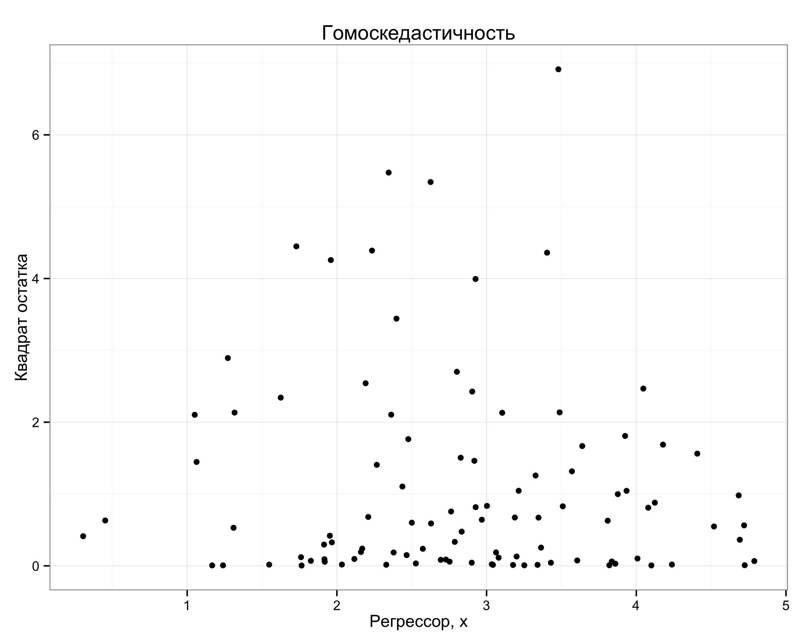
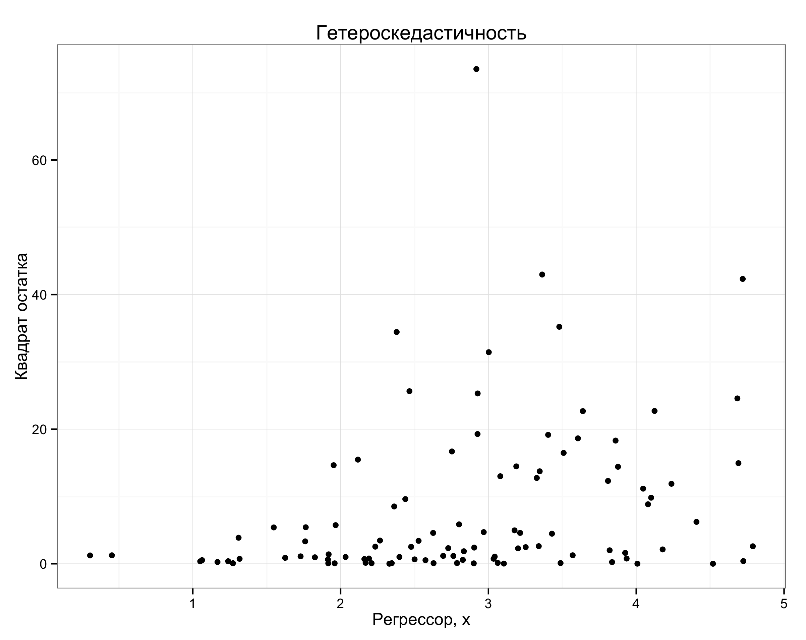

## Гомоскедастичность

Для проверки гипотез мы предполагали условную гомоскедастичность ошибок:

$Var(\varepsilon_i | X)=E(\varepsilon_i^2 | X)=\sigma^2$

Что произойдет если эта предпосылка будет нарушена?

## Четыре разных понятия

Условная гомоскедастичность $Var(\varepsilon_i | X)=E(\varepsilon_i^2 | X)=\sigma^2$

Условная гетероскедастичность  $Var(\varepsilon_i | X)=E(\varepsilon_i^2 | X) \neq const$

Безусловная гомоскедастичность $Var(\varepsilon_i)=E(\varepsilon_i^2)=\sigma^2$

Безусловная гетероскедастичность $Var(\varepsilon_i)=E(\varepsilon_i^2) \neq \sigma^2$


## Примеры [доска]

Имеет ли место условная/безусловная гетероскедастичность в каждом из случаев?

* Случай А: $\e_i$ независимы и одинаково распределены

|   Вероятности | $\e_i=-10$ | $\e_i=-1$ | $\e_i=1$ |  $\e_i=10$ |
|---------------|------------|-----------|----------|------------|
| $x_i=1$ | 0 | 1/4 | 1/4 | 0 |
| $x_i=10$ | 0 | 1/4 | 1/4 | 0 |

* Случай B: $\e_i$ независимы и одинаково распределены

|   Вероятности | $\e_i=-10$ | $\e_i=-1$ | $\e_i=1$ |  $\e_i=10$ |
|---------------|------------|-----------|----------|------------|
| $x_i=1$ | 1/4 | 0 | 0 | 1/4 |
| $x_i=10$ | 1/4 | 0 | 0 | 1/4 |

## Примеры [доска]

Имеет ли место условная/безусловная гетероскедастичность в каждом из случаев?

* Случай C: $\e_i$ независимы

|   Вероятности | $\e_1=-10$ | $\e_1=-1$ | $\e_1=1$ |  $\e_1=10$ |
|---------------|------------|-----------|----------|------------|
| $x_1=1$ | 0 | 1/4 | 1/4 | 0 |
| $x_1=10$ | 0 | 1/4 | 1/4 | 0 |


|   Вероятности | $\e_2=-10$ | $\e_2=-1$ | $\e_2=1$ |  $\e_2=10$ |
|---------------|------------|-----------|----------|------------|
| $x_2=1$ | 0 | 1/4 | 1/4 | 0 |
| $x_2=10$ | 1/4 | 0 | 0 | 1/4 |


## Когда логично ожидать гетероскедастичность?

* безусловной в случайной выборке не бывает

* условная возникает при наличии "размера" объекта

* условная присутствует почти всегда


## В остальном всё ок

Предпосылка об условной гомоскедастичности нарушена.

Все остальные предпосылки классической модели со стохастическими регрессорами для случайной выборки выполнены.


##  Мы используем прежние формулы:

Для оценок коэффициентов:

$\hat{\beta}=(X'X)^{-1}X'y$

Для оценки ковариационной матрицы оценок коэффициентов:

$\widehat{Var}(\hat{\beta}|X)=\frac{RSS}{n-k}(X'X)^{-1}$

В частности: 

$\widehat{Var}(\hat{\beta}_j|X)=\frac{\hat{\sigma}^2}{RSS_j}$
и $se(\hat{\beta}_j)=\sqrt{\widehat{Var}(\hat{\beta}_j|X)}$


## Три группы свойств:

- конечная выборка без предположения о нормальности $\varepsilon$

- конечная выборка с предположением о нормальности $\varepsilon$

- асимптотические свойства без предположения о нормальности  $\varepsilon$

Что происходит в каждом случае?

## Малая выборка без нормальности $\varepsilon$

* (+) Линейность по $y$

* (+) Несмещенность, $E(\hat{\beta}|X)=\beta$, $E(\hat{\beta})=\beta$

* (---) Оценки $\hat{\beta}$ эффективны


##  Малая выборка с нормальными $\varepsilon$

* (---) $\frac{\hat{\beta}_j-\beta_j}{se(\hat{\beta}_j)} | X \sim t_{n-k}$

* (---) $\frac{RSS}{\sigma^2} |X \sim \chi^2_{n-k}$

* (---) $\frac{(RSS_R-RSS_{UR})/r}{RSS_{UR}/(n-k)} \sim F_{r,n-k}$

##  Асимптотические свойства

* (+) $\hat{\beta} \to \beta$

* (+) $\frac{RSS}{n-k} \to \sigma^2=Var(\e_i)$

* (---) $\frac{\hat{\beta}_j-\beta_j}{se(\hat{\beta}_j)} \to N(0,1)$

* (---) $\frac{RSS_R-RSS_{UR}}{RSS_{UR}/(n-k)} \to \chi^2_r$


## Мораль:

* Сами $\hat{\beta}$ можно интерпретировать и использовать

* Стандартные ошибки $se(\hat{\beta}_j)$ несостоятельны

* Не можем строить доверительные интервалы для $\beta_j$ и проверять гипотезы

## Что делать?

* Исправить стандартные ошибки! 

* Другая формула для оценки $\widehat{Var}_{HC}(\hat{\beta}|X)$

* Следовательно, другие $se_{HC}(\hat{\beta}_j)$


## Робастная (устойчивая) к гетероскедастичности оценка ковариационной матрицы

* Вместо 

$\widehat{Var}(\hat{\beta}|X)=\frac{RSS}{n-k}(X'X)^{-1}$ 

использовать 

$\widehat{Var}_{HC}(\hat{\beta}|X)=(X'X)^{-1}X'\hat{\Omega}X(X'X)^{-1}$

* Уайт, 1980, HC0: 

$\hat{\Omega}=diag( \hat{\varepsilon}_1^2, \ldots, \hat{\varepsilon}_n^2 )$

* Современный вариант, HC3: 

$\hat{\Omega}=diag \left( \frac{\hat{\varepsilon}_1^2}{(1-h_{11})^2}, \ldots, \frac{\varepsilon_n^2}{(1-h_{nn})^2} \right)$


## Суть корректировки:

Мы меняем $se(\hat{\beta}_j)$ на $se_{HC}(\hat{\beta}_j)$

Какие проблемы решены?

* (+) $\frac{\hat{\beta}_j-\beta_j}{se_{HC}(\hat{\beta}_j)} \to N(0,1)$ (УРА!)

## Какие проблемы не решены?

* (---) эффективность

Оценки $\hat{\beta}$ не меняются и остаются неэффективными!

Даже при предположении о нормальности $\varepsilon$:

* (---) $\frac{\hat{\beta}_j-\beta_j}{se_{HC}(\hat{\beta}_j)} | X \sim t_{n-k}$

* (---) $\frac{RSS}{\sigma^2} |X \sim \chi^2_{n-k}$

* (---) $\frac{(RSS_R-RSS_{UR})/r}{RSS_{UR}/(n-k)} \sim F_{r,n-k}$

## С практической точки зрения:

* Новая формула для $\widehat{Var}_{HC}(\hat{\beta}|X)$, и, следовательно, для  $se_{HC}(\hat{\beta}_j)$

* робастная ковариационная матрица в R (по умолчанию HC3):

```{r, eval=FALSE}
model <- lm(y~x, data=data)
vcovHC(model)
```


* С ней жизнь прекрасна!

(+) $\frac{\hat{\beta}_j-\beta_j}{se_{HC}(\hat{\beta}_j)} \to N(0,1)$

## Когда следует использовать робастные стандартные ошибки?

* Как только есть случайная выборка и объекты могут быть разного "размера", использовать $se_{HC}(\hat{\beta}_j)$ для проверки гипотез!


## Обнаружение гетероскедастичности

* Оцениваем интересующую нас модель с помощью МНК

* Строим график квадратов (или модулей) остатков в зависимости от регрессора

## Условная гомоскедастичность



## Условная гетероскедастичность




## Формальные тесты на гетероскедастичность

* Тест Уайта (White)

* Тест Голдфельда-Квандта (Goldfeld-Quandt)

## Тест Уайта

* асимптотический

* не требуется нормальность остатков

## Тест Уайта, алгоритм

1. Оценить основную регрессию, получить $\hat{\varepsilon}_i$

2. Оценить вспомогательную регрессию:

$\hat{\varepsilon}^2_i = \gamma_1 + \gamma_2 z_{i2} + \ldots + \gamma_{m} z_{im}+ u_i$

$z_{i2}$, \ldots, $z_{im}$ --- факторы, определяющие форму гетероскедастичности.

По умолчанию во вспомогательной регрессии берут исходные регрессоры, их квадраты и попарные произведения

3. Посчитать $LM=nR^2_{aux}$

## Тест Уайта 

При верной $H_0$ об условной гомоскедастичности:

$H_0$: $Var(\e_i|X)=E(\varepsilon^2_i|X)=\sigma^2$

$LM \sim \chi^2_{m-1}$, где $m$ --- число параметров во вспомогательной регрессии


Если наблюдаемое значение статистики $LM$ больше критического $\chi^2_{cr}$, то $H_0$ отвергается.

## Тест Уайта [доска]

По 200 киоскам мороженого и  исследователь оценил зависимость спроса (q) от цены (p), разнообразия ассортимента (a) и удаленности от метро (d).

* Какой регрессор скорее всего влияет на условную дисперсию ошибок?

Исследователь провел классический тест Уайта и получил $R^2_{aux}=0.2$.

* Как выглядит вспомогательная регрессия для теста Уайта?

* Имеет ли место условная гетероскедастичность?

## Тест Голдфельда-Квандта (Goldfeld-Quandt)

* Есть переменная, от которой условная дисперсия ошибок предположительно зависит монотонно

* Требуется нормальность ошибок

* Тест подходит для малых выборок

## Процедура теста Голдфельда-Квандта

1. Сортируем наблюдения по предполагаемому убыванию условной дисперсии

2. Выкидываем часть наблюдений посередине (например, 20\%)

3. Оцениваем исходную модель отдельно по первым и по последним наблюдениям

4. Считаем $F=\frac{RSS_1/(n_1-k)}{RSS_2/(n_2-k)}$

## Тест Голдфельда-Квандта продолжение

При верной $H_0$ об условной гомоскедастичности:

$H_0$: $Var(\e_i|X)=E(\varepsilon^2_i|X)=\sigma^2$

$F\sim F_{n_1-k,n_2-k}$

Если наблюдаемое значение статистики $F$ больше критического $F_{cr}$, то $H_0$ отвергается.


## Тест Голдфельда-Квандта [доска]

По 200 киоскам мороженого и  исследователь оценил зависимость спроса (q) от цены (p), разнообразия ассортимента (a) и удаленности от метро (d).

Чтобы проверить наличие гетероскедастичности исследователь оценил эту модель отдельно по 80 самым удаленным от метро киоскам, получил, $RSS_2=120$. По 80 самым близки к метро киоскам, получил, $RSS_1=210$. 

Проведите тест Голдфельда-Квандта

## Эффективность оценок?

* Да, надо смириться с тем, что оценки неэффективны

* Мы довольны несмещенностью, состоятельностью и возможностью проверять гипотезы

* Для получения эффективных оценок нужно точно понимать как устроена гетероскедастичность. Это большая редкость.


## Получение эффективных оценок [доска]

Модель $m_i = \beta_1 + \beta_2 r_i + \beta_3 t_i + \e_i$:

* $m_i$ --- средний результат класса по математике

* $r_i$ --- количество учеников

* $t_i$ --- среднее время, потраченное на занятия математикой

* Какую структуру гетероскедастичности логично ожидать?

* Как при такой структуре гетероскедастичности получить эффективные оценки?

## Мораль

* Нарушение предпосылки об условной гомоскедастичности

* Почти всегда имеет место в случайной выборке
 
* Неприятность небольшая, мы используем робастные стандартные ошибки

* Если нужны эффективные оценки, то надо знать структуру гетероскедастичности
