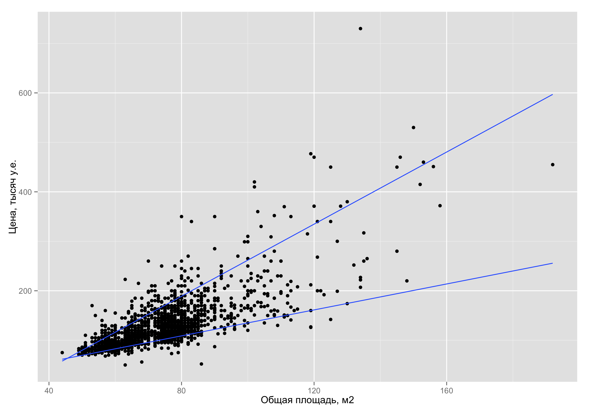

```{r, include=FALSE}
library("knitr")
library("pander")
opts_chunk$set(echo=FALSE, warning=FALSE, message=FALSE)
library("rattle")
#library("caret")
library("rpart")
library("quantreg")
library("ggplot2")
library("tikzsetup")
#tikzsetup()
```


# Три сюжета

* Квантильная регрессия

* Алгоритм случайного леса

* Байесовский подход

# Квантильная регрессии

Моделировать можно не только среднее, но и медиану или другой определённый квантиль.

# Классическая регрессия --- модель для среднего 

Предпосылки классической модели:

* $y_i=\beta_1 + \beta_2 x_i + \e_i$

* экзогенность, $E(\e_i | x_i)=0$ 

* другие предпосылки

Следствие:

\[
E(y_i|x_i)=\beta_1 + \beta_2 x_i
\]

# Минимизация суммы квадратов

Модель: $E(y_i|x_i)=\beta_1 + \beta_2 x_i$

* Сумма квадратов остатков, $Q(\hb_1,\hb_2)=\sum_i (y_i - \hy_i)^2$

* Минимизируя $Q(\hb_1,\hb_2)$ получаем состоятельные оценки $\hb_1$, $\hb_2$

# Медианная регрессия

Модель: $Med(y_i|x_i)=\beta_1 + \beta_2 x_i$

На большой выборке:

Математическое ожидание --- среднее арифметическое значение объясняемой переменной $y_i$ при заданном $x_i$

Медиана, $Med(y_i|x_i)$ ---  число, больше которого оказывается ровно половина $y_i$ при заданном $x_i$


# Алгоритм получения оценок

* Сумма модулей остатков, $M(\hb_1,\hb_2)=\sum_i |y_i - \hy_i|$

* Минимизируя $M(\hb_1,\hb_2)$ получаем состоятельные оценки $\hb_1$, $\hb_2$

# Пример у неоновой доски

Найдите оценку $\hb$ медианной регрессии: 
\[
Med(y_i|x_i)=\beta x_i
\]

Набор данных:

```{r}
x <- c(1,5,5)
y <- c(1,2,6)
df <- data.frame(y=y,x=x)
pander(df)
```


# Медианная и классическая регрессия

* Классическая: от каких факторов зависит $E(y_i|x_i)$?

* Медианная: от каких факторов зависит $Med(y_i|x_i)$?

* Оценки $\hat{\beta}_j$ и $se(\hat{\beta}_j)$ считаются по разным формулам

* Если распределение $\e_i$ симметрично, то оба подхода дают асимптотически одинаковые оценки

* Сходная проверка гипотез: $t=\frac{\hat{\beta}_j-\beta_j}{se(\hat{\beta}_j)} \to N(0,1)$


# Медианная регрессия: минусы

* Нет явных формул для оценок коэффициентов и стандартных ошибок

* Только асимптотические свойства оценок коэффициентов

# Медианная регрессия: плюсы 

* Взгляд на данные с другой стороны

* Более устойчивые оценки в случае "выбросов" в $\e_i$


# Произвольная квантиль

* Медиана, $Med(y_i)$, --- квантиль 50\%

$P(y_i \leq Med(y_i))=0.5$

* Квантиль порядка $\tau$, $q_{\tau}$:

$P(y_i \leq q_{\tau})=\tau$

* Например:

Квантиль порядка 10% для $y_i$ --- такое число $q_{0.1}$, что вероятность того, что $y_i$ окажется меньше этого числа, равна 10%.

# Квантильная регрессия

Модель: $q_{\tau}(y_i|x_i)=\beta_1^{\tau} + \beta_2^{\tau} x_i$

* Зависимость для разных квантилей может быть разная!


# Асимметричная сумма модулей остатков: 

$M(\hb_1,\hb_2)=\sum_i w_i \cdot |y_i - \hy_i|$

где веса $w_i$ равны:

\[
w_i=\begin{cases}
(1-\tau), \; y_i < \hy_i \\
\tau, \; y_i \geq \hy_i \\
\end{cases}
\]

* Минимизируя $M(\hb_1,\hb_2)$ получаем состоятельные оценки $\hb_1$, $\hb_2$

# Квантильная регрессия стоимости квартир

недорогое жильё (10\%-ый квантиль):

$\widehat{price}_i  = 3.9 +  1.3 totsp_i$

дорогое жильё (90\%-ый квантиль):

$\widehat{price}_i =  -102.4 + 3.6 totsp_i$


# Квантильная регрессия стоимости на графике

```{r}
f <- read.table("flats_moscow.txt", header = TRUE, sep="\t")

model <- rq(data=f, price~totsp, tau=c(0.1,0.5,0.9))
#summary(model)

base <- qplot(data=f, y=price, x=totsp, xlab="Общая площадь, м2",ylab="Цена, тысяч у.е.") 
# base
base_q <- base + stat_smooth(se=FALSE, method = "rq", tau=0.1) + 
  stat_smooth(se=FALSE, method = "rq", tau=0.9) 
#base_q 
ggsave(filename = "base_q.png",plot = base_q)
```



# Алгоритм случайного леса

* Очень хорошо прогнозирует

* Не объясняет, как устроены данные

# Две версии алгоритма

* Для непрерывной $y_i$

* Для качественной $y_i$


# Каждый мужчина должен посадить дерево

Набор данных

```{r}
t <- data.frame(y=c(1,1,2,10,20), x=c(1,0,0,0,1), z=c(-2,3,-4,9,9))
pander(t)
```

# Каждый мужчина должен посадить дерево

```{r}
fit <- rpart(data=t, y~x+z, control = rpart.control(minsplit = 2))
fancyRpartPlot(fit,sub="")
```
<!--
(рассказываю, что прогнозировать легко)
-->

# Как посадить дерево?

* Из имеющихся $k$ переменных случайно отбираем $k'=\lceil k/3 \rceil$ переменных

* Из отобранных $k'$ переменных выбираем ту, которая даёт наилучшее деление ветви дерева на две

* Повторяем до тех пор, пока в каждом терминальном узле остаётся больше $nodesize=5$ наблюдений

# Наилучшее деление

До деления: $RSS=274.8$

$\{ 1, 1, 2, 10, 20\}$, $\hy=\bar{y}=6.8$, 

После разбиения: $RSS=RSS_1+RSS_2=50.67$

Слева: $\{ 1, 1, 2 \}$,  $\hy=\bar{y}=1.33$, $RSS_1=0.67$ 

Справа: $\{10,20\}$, $\hy=\bar{y}=15$, $RSS_2=50$


# Алгоритм случайный

Повторное применение алгоритма к тому же набору данных даст слегка другие оценки


# Мужчина, владеющий R, может посадить целый лес!

* Случайным образом отбираем (с повторениями) $n$ наблюдений из исходных $n$ наблюдений

* Сажаем дерево по случайной подвыборке

* Повторяем до получения $n_{tree}=500$ деревьев

# Прогноз случайного леса:

* Каждое из $n_{tree}=500$ деревьев даёт свой прогноз $\hy_i$

* Усредняем и получаем финальный прогноз

# Неоновая доска. Пример построения регрессионного дерева


```{r}
x <- 1:5
y <- c(1,2,9,10,10)
df <- data.frame(y=y,x=x)
pander(df)
```


# Байесовский подход

Опишем наше незнание параметра $\theta$ в виде априорного закона распределения!

# Пример. Неизвестная вероятность

* $p \in [0;1]$  

Априорная плотность:

\[
f(p)=\begin{cases}
1, \; p\in[0;1] \\
0, \; \text{ иначе }
\end{cases}
\]


# Пример. Неизвестный положительный коэффициент 

* $\beta \in [0;+\infty)$ 

Априорная плотность:

\[
f(\beta)=\begin{cases}
exp(-\beta), \; \beta \in[0;\infty) \\
0, \; \text{ иначе }
\end{cases}
\]

# Модель 

Модель задаёт закон распределения наблюдений, $y_i$, при фиксированном значении параметров

Например,

\[
y_i = \beta_1 + \beta_2 x_i + \e_i, \; \e_i \sim N(0,\sigma^2)
\]

# Кристально-чистая логика байесовского подхода

Определяем:

* Априорное распределение, $f(\theta)$

* Модель для данных, $f(y|\theta)$

По формуле условной вероятности получаем:

* Апостериорное распределение, $f(\theta|y)$

# Формула условной вероятности

\[
f(\theta|y)= \frac{f(y|\theta)\cdot f(\theta)}{f(y)} \sim f(y|\theta)\cdot f(\theta)
\]

# Пример у неоновой доски

Наблюдения: пойманы 2 карася и щука.

Отдельные наблюдения независимы, вероятность поймать щуку и карася стабильна во времени.

Найдите апостериорную плотность вероятности поймать карася в пруду.

* нет информации

* Бабушка: караси встречаются чаще щук!


# Как описать сложную функцию плотности?

```{r, fig.width=5, fig.height=5}
x1 <- rnorm(50, mean=0, sd=1)
x2 <- rnorm(70, mean=4, sd=1)
x <- c(x1,x2)
qplot(x, geom="density") + geom_rug() + xlab("r") + ylab("") 
```

# Сколь угодно точное описание любой плотности!

* Большая выборка независимых значений случайной величины $r$: 

$r_1$, $r_2$, $r_3$, \ldots, $r_{10000}$


* Можно оценить всё: $E(r)$, $E(r^2)$, $P(r>0)$

# Монте-Карло по схеме Марковской цепи

MCMC (Markov Chain Monte Carlo)

Заменяет формулу условной вероятности 

# Алгоритм MCMC

На входе:

* Априорное распределение, $f(\theta)$

* Модель для данных, $f(y|\theta)$

На выходе: 

* Большая выборка из апостериорного распределения, $f(\theta|y)$


# Алгоритм случайный

Повторное применение алгоритма к тому же набору данных даст слегка другие оценки

# Плюсы байесовского подхода

* Можно задавать вопросы про неизвестные параметры:

$P(\beta_3 >0 | y)$, $P(\beta_3=0 | y)$, $E(\beta_3 | y)$?

* Апостериорное распределение есть всегда!

даже при жесткой мультиколлинеарности и полном отсутствии наблюдений

# Минусы байесовского подхода

* Его не все знают 

* Может требовать больших объемов вычислений

# MCMC и логит

"Идеальное прогнозирование" --- ситуация, в которой ML оценки логит-модели не существуют


# Логит-модель

$y_i \in \{0,1\}$.

$y_i=\begin{cases}
1, y^*_i \geq 0 \\
0, y^*_i <0
\end{cases}$

Скрытая переменная: $y^*_i=\beta_1 +\beta_2 x_i +\varepsilon_i$.

# Априорное распределение для логит модели


$\beta \sim N(b_0, B_0^{-1})$

Гиперпараметры:

$b_0$ --- априорное среднее

$B_0$ --- априорная матрица точности

$B_0^{-1}=Var(\beta)$

# Выбор априорных гиперпараметров

Традиционно:

$b_0 = (0, 0, \ldots, 0)'$

$B_0 = \begin{pmatrix}
d & 0 & 0 & \ldots \\
0 & d & 0 & \ldots \\
0 & 0 & d & \ldots \\
\vdots & \vdots & \vdots & \\
\end{pmatrix}$

Число $d$ мало

То есть: $\beta_1 \sim N(0, 1/d)$, $\beta_2 \sim N(0, 1/d)$, ...

# Пример проблемной ситуации

```{r}
x <- c(1,2,3)
y <- c(0,0,1)
df <- data.frame(y=y,x=x)
pander(df)
```

Логит и пробит оценки не существуют

# Логит со вкусом Байеса

Априорно: $\beta_1 \sim N(0, 10^2)$, $\beta_2 \sim N(0, 10^2)$

Апостериорные средние:

$\hy_i^*=-10.8 + 4.5 x_i$

$y_i=\begin{cases}
1, y^*_i \geq 0 \\
0, y^*_i <0
\end{cases}$


# Регрессия пик-плато

Модель: $y_i = \beta_1 + \beta_2 x_i + \beta_3 z_i +\e_i$, $\e_i \sim N(0, \sigma^2)$


# Вариант априорного распределения пик-плато

* $\beta_j | \gamma_j, \tau^2_j  \sim N(0, \gamma_j \cdot \tau^2_j )$

* $\gamma_j = \begin{cases}
1, \text{ с вероятностью } 1/2 \\
0, \text{ с вероятностью } 1/2 
\end{cases}$

* $\tau_j^2 \sim \Gamma^{-1}(a_1,a_2)$

* $\sigma^2 \sim \Gamma^{-1}(b_1,b_2)$

Гиперпараметры: $a_1$, $a_2$, $b_1$, $b_2$

# Регрессия пик-плато

Позволяет напрямую отвечать на вопрос:

Чему равна вероятность $P(\beta_2 = 0 | y)$?

# Пример с машинами

Апостериорные средние значения коэффициентов:

$\widehat{dist}_i =  12.81 + 0.28 speed_i + 0.01 speed_i^2$

Апостериорные вероятности:

$P(\beta_{speed}=0 | y )=0.15$

$P(\beta_{speed^2}=0 | y )=0.05$

# Большое спасибо

Нам не удалось решить все наши задачи. 


Решения, что мы находим, лишь ставят перед нами новые вопросы. В каком-то смысле, мы также мало знаем, как и раньше. Но мы верим, что наше незнание стало глубже, а не знаем мы всё более важные вещи.


Большое спасибо тем, кто прошел вместе с нами этот курс до конца!


